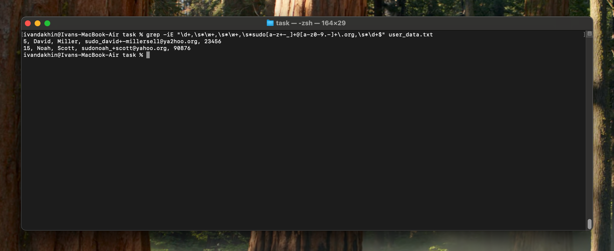
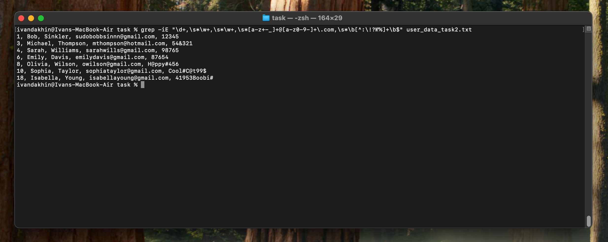
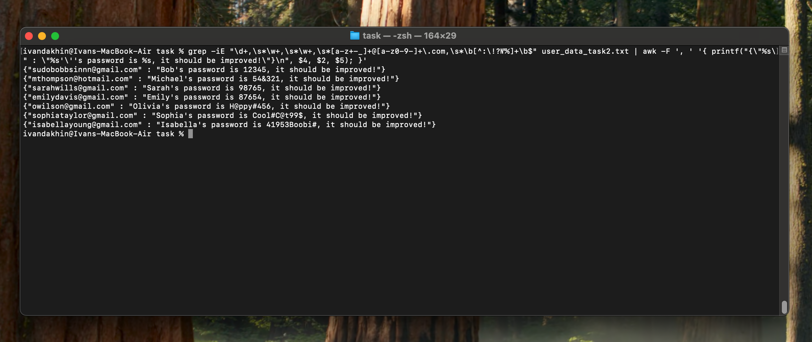

## Task1

`(70points)`

- [x] Download archive 'textprocessingtask.tar', there are needed files there.
- [x] Using regular expressions and any of the tools like grep, sed, or awk, search for emails in the file 'user_data.txt' that start with 'sudo' and end with 'org'.

### Solution:
```bash
grep -iE "\d+,\s*\w+,\s*\w+,\s*sudo[a-z+-_]+@[a-z0-9.-]+\.org,\s*\d+$" user_data.txt
```

## Task2
`* (90points)`

- [x] In the file 'user_data_task2.txt', identify all individuals who have a valid email address ending with 'com' and a weak password that lacks special characters such as ! № % : ?.

### Solution:
```bash 
grep -iE "\d+,\s*\w+,\s*\w+,\s*[a-z+-_]+@[a-z0-9-]+\.com,\s*\b[^:\!?№%]+\b$" user_data_task2.txt
```

## Task3
`**(100points)`

- [x] Based on the previous task's results, retrieve the name and password, and construct a sentence in the following format:

`{"sudobobbsinnn@gmail.com" : "Bob's password is 12345, it should be improved!"}`

### Solution:
```bash
grep -iE "\d+,\s*\w+,\s*\w+,\s*[a-z+-_]+@[a-z0-9-]+.com,\s*\b[^!№%:?]+\b$" user_data_task2.txt | \
awk -F ', ' '{ printf("{\"%s\" : \"%s'\''s password is %s, it should be improved!\"}\n", $4, $2, $5); }'
```


